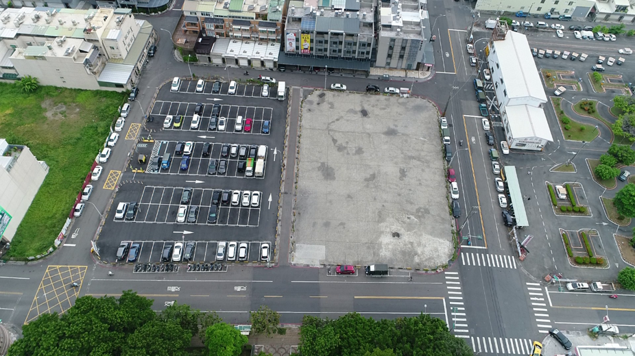
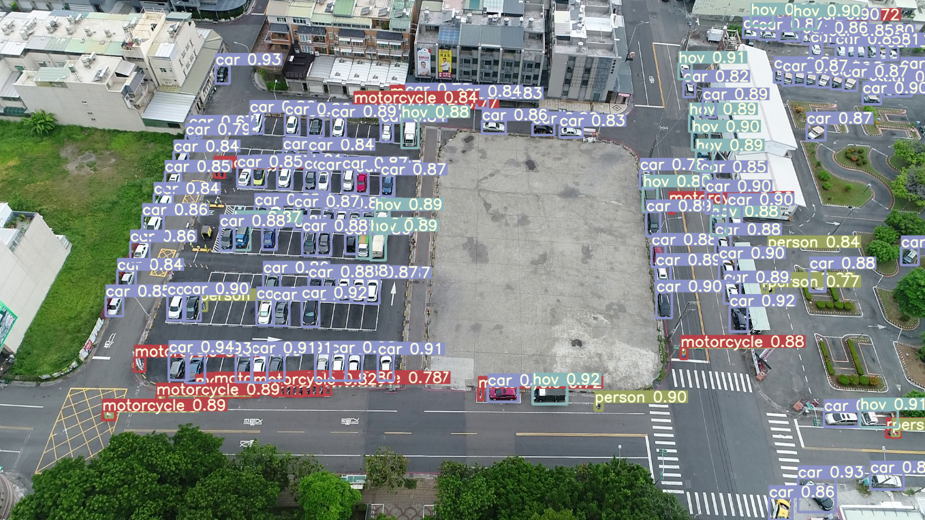
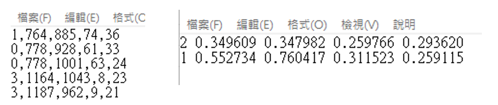
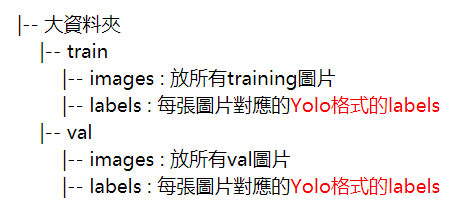
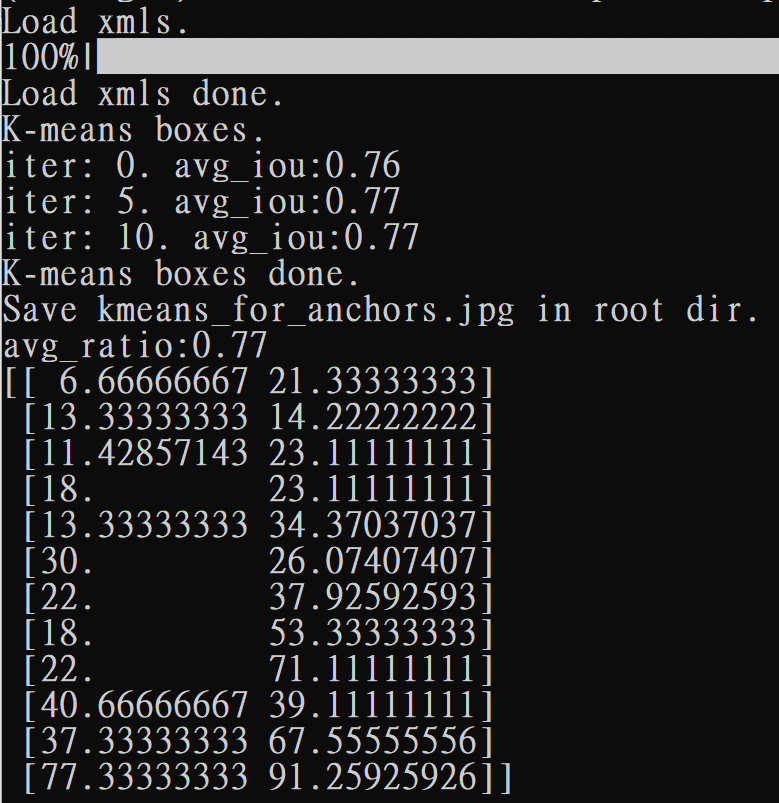
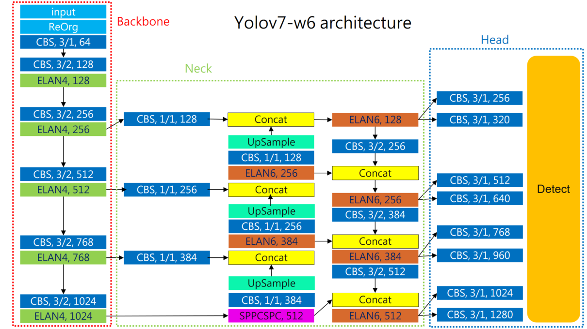
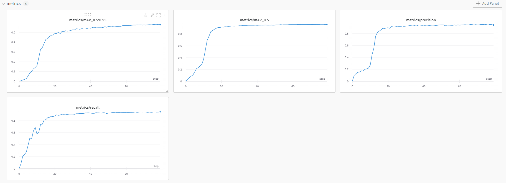
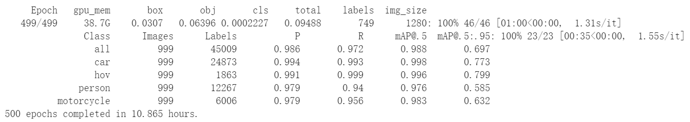
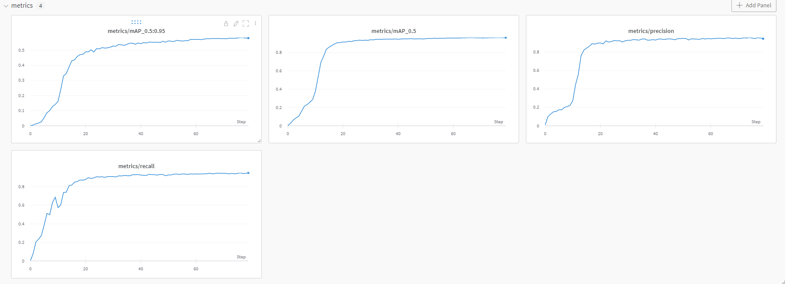
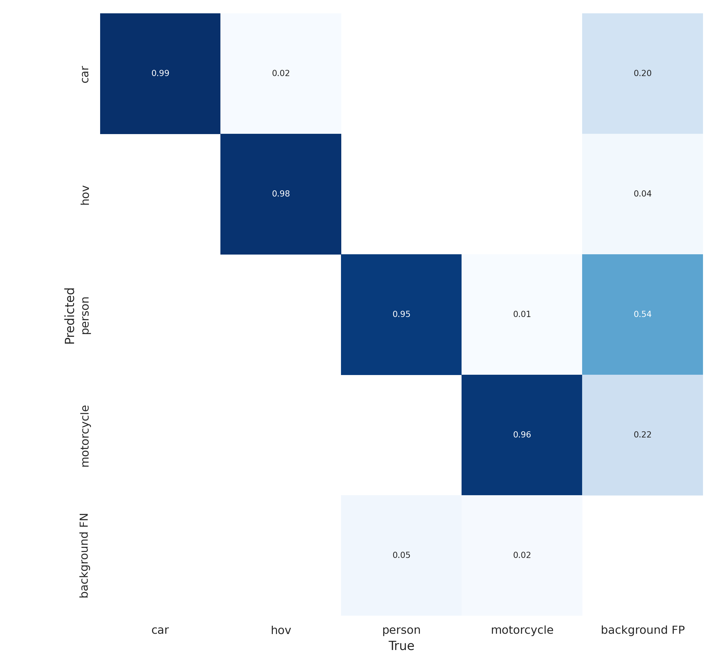

# Drone
1213

---
競賽網址：https://tbrain.trendmicro.com.tw/Competitions/Details/25


## 參賽成績
Team:TEAM_2724  
Member: Tun-yu  
Rank: **18th** / 236 Teams   
Private Leaderboard Hmean_TIOU : 0.73922


## CV Task:物件偵測  
將無人機視角的圖片做物件偵測，框出 "小型車"、"大型車"、"人"、"機車"這幾個類別  
input:  


output:  


## Dataset

1.   [比賽官方提供的 Dataset](https://tbrain.trendmicro.com.tw/Competitions/Details/25)
2.   [外部資源-VisDrone Dataset](https://github.com/VisDrone/VisDrone-Dataset)
  
## 訓練流程

 step1: [](https://colab.research.google.com/drive/1-RwWhtqdBMtCI226RUF_BpXLFYLewwYt?usp=sharing)

 step2: [](https://colab.research.google.com/drive/1m2ie2S5gNybBC9RhVMmHyge8_XYzmlCS?usp=sharing)

   step3: [](https://colab.research.google.com/drive/1JVfrnnpC6W3X3Yu1a53eN0xMh3OwsEZN?usp=sharing)

   step4&Output: [](https://colab.research.google.com/drive/1QIcEhmJzFcMCfSqRyzZKm5JLr4Dqz0qN?usp=sharing)


## 安裝環境   
[requirements](https://github.com/WongKinYiu/yolov7/blob/main/requirements.txt)

```
pip install -r requirements.txt
```


## Yolo格式
把Raw data的label整理成Yolo格式  
左:原本的Raw data label寫法為 類別idx,左上x, 左上y, 寬度W, 高度H  
右: 希望轉成的Yolo標準格式寫法為 類別idx 中心點x 中心點y 寬度W 高度H  
=>除了類別idx之外的數字都要經過 normalization，把分隔符號從逗號變成空格


執行之前先確認:  
    img資料夾:所有的圖片(做normalization需要得知原圖的寬、高)  
    label資料夾:所有圖片對應的txt檔(比賽官方給的格式)  
    new_label資料夾 : 空的，準備接轉檔後yolo格式的一堆txt 
```
python to_yolo.py
```
為了方便起見，先把圖片和label整理成這種架構  


## 取得Anchor box尺寸
目標: 取得自己的Dataset的Anchor box尺寸  
注意: 此時txt已經是Yolo格式  
動機: 在這次比賽中希望求出屬於本次比賽Dataset的Anchor box，為了方便起見，要把label轉成XML格式

1: 取得XML格式的label
由於目前只有TXT檔(Yolo格式)的label，為了等一下方便起見這邊要把TXT檔轉成XML檔  

##### 注意參數 
file_dir : 有一堆原圖+對應TXT檔(Yolo格式) 的路徑 
可以設定classmap在生成的XML檔印出類別名稱(不影響後續找Anchor box)，不特別設定的話可以XML上面印出類別index。
```
python mytxt2xml.py
```
執行完會一張一張慢慢跑，如果太快的話很可能是路徑不對或副檔名指定錯，最後如果順利的話會生成對應的XML檔


2: 用分群方法取得自己的Dataset的Anchor box尺寸  
目前已經得到所有Dataset圖片 label的XML檔，這步會用k-means的方法求出k個群中心點，得到一組針對此Dataset的Anchor box，提供之後訓練Yolo模型時使用。  

##### 注意參數    
input_shape : 圖片大小，最好跟之後訓練、推論的大小一致  
anchors_num : 就是k-means的 'k'，要分幾群  
path : 有一堆XML檔所在路徑  
```
python myanchors.py
```
會印出分群結果  
  


  
還會在當前路徑下生成yolo_anchors.txt 裡面是 k組Anchor box的尺寸，每次分群的結果可能稍微不一樣 可以試試看多執行幾次比對結果。
  
這次比賽我總共使用2個dataset，分別是比賽官方提供的無人機dataset和我另外找的VisDrone dataset，我這次使用的是yolov7-w6來訓練，其預設的Anchor box和我用到的2個Dataset求得的Anchor box尺寸相差很大，特別是大物件的Anchor box，可能是無人機視角的關係 不太會有機會出現某物件在圖片中涵蓋大範圍的情形，因此在訓練時我都會修改Anchor box尺寸 將其設定為我針對自己的Dataset用k-means所求得的值。  

最後在正式訓練模型前要先去 yolov7/cfg/training 這個資料夾底下 修改  XX.yaml 檔，把作者訓練的dataset求得的Anchor box尺寸，換成上面得到的針對自己的dataset的Anchor box尺寸。  
**注意圖片大小(Input size)要和生成的Anchor box對應**

無人機dataset修改Anchor box  
`!sed -n -e 8p -e 9p -e 10p -e 11p cfg/training/yolov7-w6.yaml`
```
!sed -i '8s/19,27,  44,40,  38,94/6,21,  13,14,  11,23/' cfg/training/yolov7-w6.yaml
!sed -i '9s/96,68,  86,152,  180,137/18,23,  13,34,  30,26/' cfg/training/yolov7-w6.yaml
!sed -i '10s/140,301,  303,264,  238,542/22,37,  17,53,  22,71/' cfg/training/yolov7-w6.yaml
!sed -i '11s/436,615,  739,380,  925,792/40,39,  37,67,  77,91/' cfg/training/yolov7-w6.yaml
```
`!sed -n -e 8p -e 9p -e 10p -e 11p cfg/training/yolov7-w6.yaml`
  
  
VisDrone dataset修改Anchor box  
`!sed -n -e 8p -e 9p -e 10p -e 11p cfg/training/yolov7-w6.yaml`
```
!sed -i '8s/19,27,  44,40,  38,94/4,9, 5,16, 6,25/' cfg/training/yolov7-w6.yaml
!sed -i '9s/96,68,  86,152,  180,137/11,14, 10,35, 16,27/' cfg/training/yolov7-w6.yaml
!sed -i '10s/140,301,  303,264,  238,542/25,19, 19,51, 37,35/' cfg/training/yolov7-w6.yaml
!sed -i '11s/436,615,  739,380,  925,792/34,82, 64,58, 97,130/' cfg/training/yolov7-w6.yaml
```
`!sed -n -e 8p -e 9p -e 10p -e 11p cfg/training/yolov7-w6.yaml`


## 比賽使用模型架構

Reference :  [yolov7-w6的yaml](https://github.com/WongKinYiu/yolov7/blob/main/cfg/training/yolov7-w6.yaml)
  



## 詳細訓練流程
#### step1: 
[](https://colab.research.google.com/drive/1-RwWhtqdBMtCI226RUF_BpXLFYLewwYt?usp=sharing)  
 在VisDrone dataset訓練80個epoch 希望可以學習到無人機視角做特徵提取。 


#### step2: 
[](https://colab.research.google.com/drive/1m2ie2S5gNybBC9RhVMmHyge8_XYzmlCS?usp=sharing)  

 
 用比賽的Dataset訓練80個epoch 發現mAP表現不太好 特別是 ’人’ 和 ’機車’ 這兩個類別的預測情形不太好嚴重拉低了mAP。


#### step3: 
[](https://colab.research.google.com/drive/1JVfrnnpC6W3X3Yu1a53eN0xMh3OwsEZN?usp=sharing)  
把VisDrone dataset的類別做一些修改 刪除一些不相關的類別並把類別做一些濃縮變成跟比賽的Dataset的類別一樣，像是VisDrone dataset有細分走在路上的行人和坐著的人，有細分普通的小轎車和休旅車，我認為細分這些對於在訓練比賽的Dataset可能有反效果，所以就把VisDrone dataset的類別給暴力濃縮了。

#### step4&Output: 
[](https://colab.research.google.com/drive/1QIcEhmJzFcMCfSqRyzZKm5JLr4Dqz0qN?usp=sharing)




## Inference On video
由於找不到比賽dataset同一視角的無人機視角影片，所以使用[coverr網站](https://coverr.co/)免費的高空俯視短片來Demo。


<details><summary> <b>Expand</b> </summary>

```
python detect.py --weights 'best.pt' \
--img-size 1280 \
--conf-thres 0.4 \
--iou-thres 0.65 \
--device 0 \
--source 'demo.mp4'
```
</details>
Origin:  

  
Inference:  


## Reference
https://github.com/WongKinYiu/yolov7
